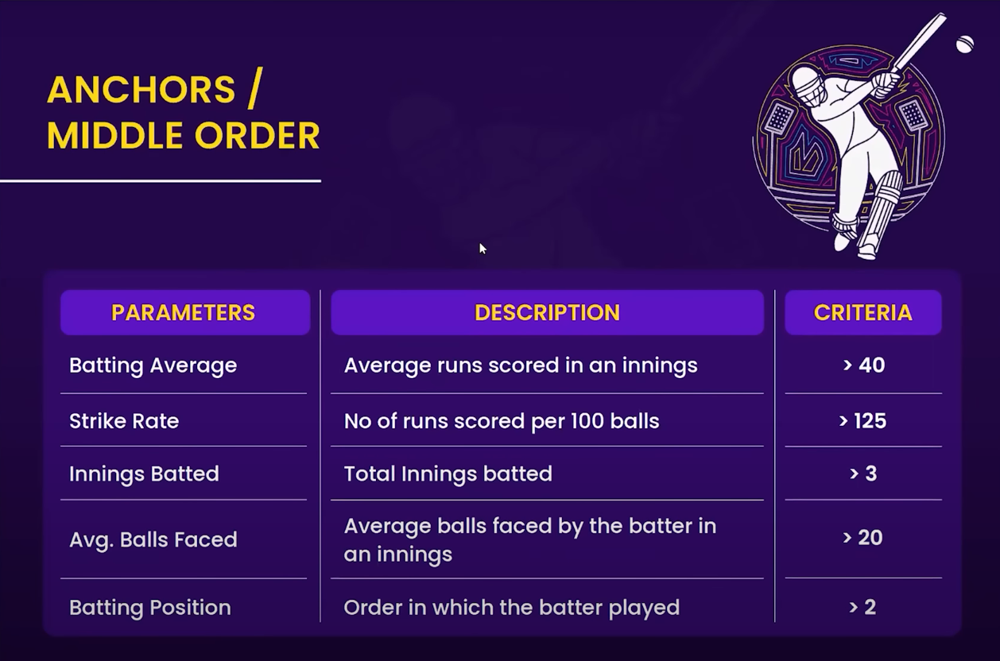

# 🏏 Project Earth's Last Stand: Cricket Analytics

## Save Earth from Alien Invasion through Cricket! 🌍👽


## 📋 Project Overview
This data analytics project aims to assemble the ultimate cricket team by analyzing player performance data from the recent World Cup. Our mission is critical: defeat an alien invasion force in a winner-takes-all cricket match to save Earth.

## 🎯 Objectives
- Analyze World Cup 2023 player statistics
- Identify optimal player combinations
- Create a balanced team capable of handling unknown alien playing conditions
- Ensure team composition meets ICC regulations (even for interplanetary matches!)

## 📊 Data Sources
- ICC World Cup 2023 Statistics
- Historical player performance data
- Player fitness metrics
- Pressure situation performance indicators
- Environmental adaptability scores

## 🤖 Player Selection Criteria

### Batsmen Requirements


### Middle-Order Requirements



### Finishers Requirements


### All-rounders Requirements


### Pacers Requirements


## 🛠️ Technical Stack
- Python 
- Pandas for data manipulation
- NumPy for numerical computations
- Matplotlib & Seaborn for visualizations
- Scikit-learn for player ranking algorithms
- Any Dashboard Tool
- Jupyter Notebooks for analysis


## 🚀 Getting Started

1. Clone the repository:
```bash
git clone https://github.com/your-username/earth-cricket-team.git
```

2. Create virtual environment:
```bash
python -m venv venv
source venv/bin/activate  # On Windows: venv\Scripts\activate
```

3. Install dependencies:
```bash
pip install -r requirements.txt
```

4. Run Jupyter Notebook:
```bash
jupyter notebook
```

## 📈 Analysis Workflow
1. Data Collection & Cleaning
2. Feature Engineering
3. Player Performance Analysis
4. Team Composition Optimization
5. Final Team Selection & Validation

## 🎮 Interactive Dashboard
Access our interactive player selection dashboard:


## 👥 Team
- Data Scientists
- Cricket Analysts
- Sports Statisticians
- Visualization Experts
- Domain Specialists

## ⚠️ Disclaimer
This project assumes that aliens play cricket according to ICC regulations. Adjustments may be needed based on actual alien cricket capabilities.

## 🌟 Acknowledgments
- International Cricket Council (ICC)
- World Cup 2023 Organizing Committee
- Cricket Statisticians worldwide
- Earth's hopes and dreams

Remember: The fate of our planet depends on this analysis. No pressure! 🌍✨
